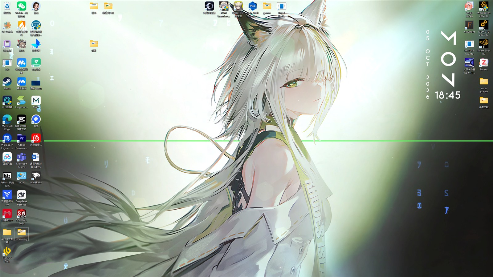
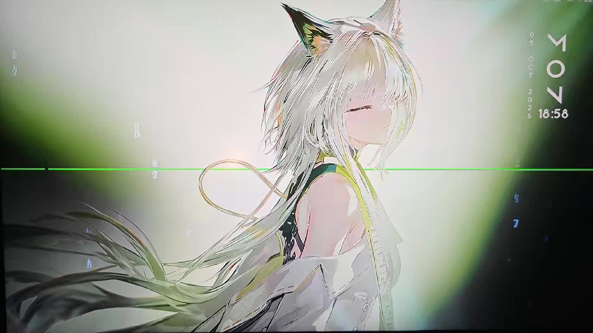

# DesktopBeautify

> Just your wallpaper. Hold **Space** and the desktop icons fade in while the taskbar slides up from the bottom edge. Release, and they're gone again.

**Windows 11** · Native C · **106 KB** single exe · **1.6 MB** resident memory · **0%** idle CPU
**No admin rights** · **No process injection** · **Zero impact on Wallpaper Engine** (measured)

[中文说明](README.md) | **English**



<p align="center">
  
  &nbsp;&nbsp;
  
</p>

### 🎬 Camera-recorded demo

[](screenshots/demo-camera.mp4)

> **Note:** screen-recording tools could not capture the fade effect, so this clip was **filmed with a camera** (click the cover to play, ~0.5 MB).

> **Note:** the application UI is in Chinese (it targets Chinese-speaking Windows users).
> The source code and these docs are fully readable to anyone.

---

## Contents

- [The problem it solves](#the-problem-it-solves)
- [Features](#features)
- [Download & install](#download--install)
- [Usage](#usage)
- [Recovery](#recovery-four-layers)
- [Uninstall](#uninstall)
- [Known limitations](#known-limitations)
- [How it works](#how-it-works)
- [Building from source](#building-from-source)
- [FAQ](#faq)
- [License](#license)

---

## The problem it solves

Many people — especially those using animated wallpapers — want a **clean desktop with nothing but the wallpaper**. But:

- Deleting the icons means digging through the Start menu every time you need one
- Third-party "icon hider" tools often pull in runtimes, or sit in memory using tens or hundreds of MB
- "Desktop organizer" apps take over your icons, leave junk behind on uninstall, and can lose your layout

**This project's approach:** the icons and taskbar are **still managed by Windows itself**. The app only flips the shell's own hide switch. Hold Space to summon them, release to hide them again. As a result:

- Tiny (106 KB) and extremely light (1.6 MB resident)
- **It never takes over or loses your icons** — it doesn't even touch their positions
- A crash, a kill, or a power loss can never lock you out (see [Recovery](#recovery-four-layers))

---

## Features

| Feature | Description |
|---|---|
| **One-key hide/show** | Desktop icons and the taskbar hide or show together. The state is written into the shell's own `HideIcons` value, so it survives a reboot |
| **Hold-Space preview** | With the desktop focused, hold Space → icons **fade in** and the taskbar **slides up as a whole** from the bottom edge. Release → both retract |
| **Icon fade** | Icons don't pop in; they develop from nothing to full opacity over ~250 ms |
| **Desktop context menu** | Right-click desktop → Show more options → "显示/隐藏桌面图标与任务栏"; the label follows the current state |
| **Tray menu** | Right-click the tray icon: toggle state / taskbar transparency mode / autostart. Left-click toggles instantly |
| **Autostart** | Writes the per-user Run key — no admin required |
| **Four-layer recovery** | From "quit from the tray" all the way to "restart Explorer" — you can always get back |

---

## Download & install

### 1. Download

Grab the latest `DesktopBeautify-v1.0.zip` from the **Releases** page and extract it into **an ordinary folder** (e.g. `D:\DesktopBeautify`).

> ⚠️ **Do not extract into a folder carrying the "Low integrity" label** (some browser download folders, cloud-sync folders, sandboxed folders).
> An exe inside such a folder is forced to run at low integrity and **cannot control the desktop icons or taskbar** — the symptom is "it runs but nothing happens".
> If unsure, run `envcheck.exe` first; it tells you whether the current folder works.

### 2. Install

Double-click **`安装.cmd`**.

If the blue "Windows protected your PC" dialog appears → **More info** → **Run anyway**.
(The app is not code-signed; this is Windows' routine prompt for unsigned software, **not a virus warning**. The full source is public — you can build it yourself and verify.)

After installation the icons and taskbar are hidden, and a "桌面美化" tray icon appears.

---

## Usage

```
1. Click once on an empty spot on the desktop (so the desktop has focus)
2. Hold Space  -> icons fade in from nothing, the taskbar slides up from the bottom
3. Release     -> they retract together
```

**Other entry points**

- Desktop right-click → Show more options → "显示/隐藏桌面图标与任务栏"
- Tray icon right-click → full menu
- Tray icon left-click → quick toggle

> 💡 **The first preview has no fade animation** — the app must capture the icon artwork once; from the second preview on, the animation plays.

---

## Recovery (four layers)

| Layer | What to do | When |
|---|---|---|
| **1** | Tray icon → right-click → quit and restore | The app is still alive |
| **2** | Double-click **`恢复.exe`** | Tray is gone / the app is hung — restores icons and taskbar in one click |
| **3** | Double-click **`一键恢复.reg`** | You only want to drop the context-menu entry and autostart |
| **4** | Double-click **`最后手段-重启资源管理器.cmd`** | The desktop itself is misbehaving |

**Why you can't get locked out:** the app never "takes over" the icons — it only calls the shell's own hide switch.
Even if it crashes, is killed, or the machine loses power, the system simply stays in the normal "icons hidden" state, and any layer above restores it immediately.

---

## Uninstall

Double-click **`卸载.cmd`**: restores icons and taskbar → stops the resident process → removes the context-menu entry → removes autostart.
Afterwards just delete the folder.

---

## Known limitations

All of these are **measured facts**, not unfinished tuning:

| Limitation | Detail |
|---|---|
| **Icons with a pure-black background** | Icons such as Fluent have a black background whose **pixel values are identical to the desktop background** (both exactly 0). During the fade that black area starts out transparent and reappears at the handover — **a brief jump is visible**. This is a mathematical ambiguity at the pixel level: lowering the threshold from 21 to 8 and then to 2 made **no difference at all** in testing, so no brightness-based approach can separate them. |
| **Multi-monitor fade** | Hide/show applies to **all** screens, but the fade animation only plays on the **largest** one (usually the primary). Icons on other screens appear directly. |
| **Taskbar not at the bottom** | If the taskbar is at the top or on a side, hide/show still works, but the "slide up as a whole" animation is skipped automatically. |
| **Taskbar transparency** | The built-in transparency is whole-window (icons dim with it). For "transparent background with crisp icons", pair it with [TranslucentTB](https://github.com/TranslucentTB/TranslucentTB) or [Windhawk's Windows 11 Taskbar Styler](https://windhawk.net/mods/windows-11-taskbar-styler). |
| **After moving an icon** | The **first preview after the move** still uses the old position; it self-corrects **from the next preview on**. |

---

## How it works

Native Win32 C, single file, no third-party dependencies. Only the conclusions are listed here — the **measurements and the dead ends** behind each one are in
**[docs/技术笔记.md](docs/技术笔记.md)** (Chinese), which is arguably more valuable than the code itself.

### 1. Hiding/showing desktop icons

- The official switch: send `WM_COMMAND, 0x7402` to `SHELLDLL_DefView` — it is a **toggle**, not a setter
- The visual state must be forced with **absolute calls** (`ShowWindow` / layered opacity). **Do not rely on the toggle** — the window's visibility and the shell's internal state can drift apart
- Persistent state lives in `HKCU\Software\Microsoft\Windows\CurrentVersion\Explorer\Advanced\HideIcons`
- With multiple monitors there may be **one `WorkerW + SHELLDLL_DefView + SysListView32` set per screen**, so all of them must be enumerated

### 2. Sliding the whole taskbar (the hardest part)

- A plain `SetWindowPos` is **reverted by the shell within 1 ms** (it intercepts `WM_WINDOWPOSCHANGING` in `TrayUI::WndProc`)
- **Adding `SWP_NOSENDCHANGING` makes the position stick** indefinitely — this is the key to moving the taskbar from outside the process

### 3. The icon fade (the core trick)

How the approach evolved (the first two were disproved by measurement):

- ✗ Give the icon window `WS_EX_LAYERED` and animate its alpha — everything outside the icons is dimmed too (**the wallpaper darkens**)
- ✗ "Screenshot the wallpaper, lay it over the icons, fade it out" — a static wallpaper image **can never match** an animated Wallpaper Engine wallpaper
- ✓ **Draw a per-pixel-alpha curtain ourselves**:
  - The surface of the desktop ListView, as captured by `PrintWindow`, is **icons composited over pure black** → the background is **exactly 0** (measured: 96.6% of a full-screen capture is exactly 0)
  - Turn it into a **per-pixel transparent** topmost curtain (`UpdateLayeredWindow` + `AC_SRC_ALPHA`), opaque only where the pixels are not background
  - Animate overall opacity by changing a single number per frame (`BLENDFUNCTION.SourceConstantAlpha`)
  - **Not a single wallpaper pixel is ever covered** → zero impact on Wallpaper Engine (measured: the wallpaper sample change stays at the noise floor for every alpha value)

---

## Building from source

Visual Studio is not required — zig ships a clang-based cross compiler as a single-file toolchain:

```bat
zig cc -target x86_64-windows-gnu -O2 -s -Wall "-Wl,--subsystem,windows" ^
    -o DesktopBeautify.exe src\DesktopBeautify.c ^
    -luser32 -lshell32 -lgdi32 -ldwmapi -lcomctl32

zig cc -target x86_64-windows-gnu -O2 -s -Wall "-Wl,--subsystem,windows" ^
    -o 恢复.exe src\RestoreTool.c -luser32 -lshell32

zig cc -target x86_64-windows-gnu -municode -O2 -s -Wall ^
    -o envcheck.exe src\envcheck.c
```

> ⚠️ Do **not** build into a folder carrying the "Low integrity" label, or the resulting exe will be downgraded and cannot control the desktop.

The repository also ships `build.cmd` (edit the zig path inside first).

---

## FAQ

<details>
<summary><b>It runs but nothing happens</b></summary>

Most likely the folder carries the "Low integrity" label. Run `envcheck.exe`; then move the whole folder to an ordinary location such as `D:\DesktopBeautify`.
</details>

<details>
<summary><b>Holding Space does nothing</b></summary>

The preview requires the **desktop to have focus** (click an empty desktop spot first). Also note the first preview has no fade animation.
</details>

<details>
<summary><b>Does it affect my animated wallpaper?</b></summary>

No. The fade uses a per-pixel transparent curtain — **the wallpaper area is physically never covered**. With Wallpaper Engine running, the measured change at wallpaper sample points equals the noise floor.
</details>

<details>
<summary><b>Can it lose my icons or their positions?</b></summary>

No. The app only toggles a single show/hide switch. It never moves, deletes, or renames anything.
</details>

<details>
<summary><b>Why is there no fade on the first preview?</b></summary>

The fade needs one icon capture (~100 ms). From the second preview on, the animation is there.
</details>

---

## License

[MIT](LICENSE) — use, modify and redistribute freely, keep the copyright notice.

## Credits

- The breakthrough for sliding the taskbar came from reading [Windhawk](https://windhawk.net/) and its mod sources
- The workable icon-fade route was found by ruling out the approaches used by [Transparent Desktop Icons with Spotlight](https://windhawk.net/mods/transparent-desktop-icons-spotlight) and friends — thanks to those projects for charting the territory
