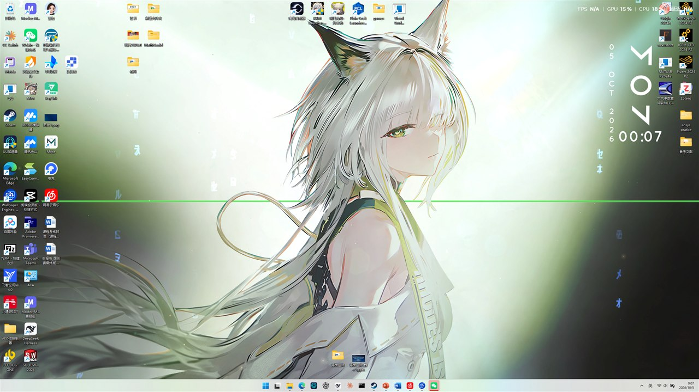
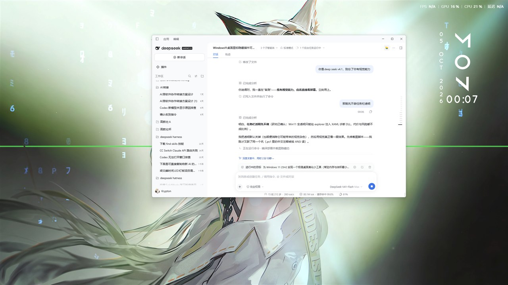

# DesktopBeautify · 桌面美化

> 平时只有一张干净的壁纸。需要时按住空格 —— **图标由浅入深地浮现，任务栏整条从屏幕下沿升起**；松开又隐藏。

**Windows 11** · 原生 C 编写 · **单文件 106 KB** · 常驻内存 **1.6 MB** · 空闲 CPU **0%**
**不需要管理员权限** · **不注入任何进程** · **对 Wallpaper Engine 零影响**（实测验证）



<p align="center">
  
  &nbsp;&nbsp;
  
</p>

---

## 目录

- [它解决什么问题](#它解决什么问题)
- [功能](#功能)
- [下载与安装](#下载与安装)
- [使用](#使用)
- [出错怎么办](#出错怎么办四层保底)
- [卸载](#卸载)
- [已知限制](#已知限制)
- [技术原理](#技术原理)
- [从源码构建](#从源码构建)
- [常见问题](#常见问题)
- [English](#english)

---

## 它解决什么问题

很多人（尤其用动态壁纸的人）想要一个**只有壁纸的干净桌面**，但：

- 把图标全删掉 → 每次要用都得去翻开始菜单，很麻烦
- 用第三方"图标隐藏"工具 → 大多要装一堆运行库，或者常驻内存几十上百 MB
- 用"桌面整理"类软件 → 会接管你的图标，卸载不干净、还可能丢图标

**这个项目的做法**：图标和任务栏**仍然由 Windows 自己在管**，本程序只是调用系统自己的开关把它们藏起来。
想要时按住空格叫出来，**松开自动藏回**。所以它：

- 体积极小（106 KB），内存占用极低（1.6 MB）
- **不会接管、不会丢你的图标** —— 它连图标的位置都不改
- 崩溃、被杀、断电都不会把你锁死（见[四层保底](#出错怎么办四层保底)）

---

## 功能

| 功能 | 说明 |
|---|---|
| **一键隐藏/显示** | 桌面图标 + 任务栏一起隐藏或显示；状态写进系统自己的 `HideIcons`，重启后依然生效 |
| **按住空格预览** | 桌面聚焦时按住空格 → 图标**淡入浮现**、任务栏**整条从屏幕下沿升起**；松开 → 一起收回 |
| **图标淡入特效** | 不是"啪"地出现，而是像显影一样由浅入深浮现（约 250ms） |
| **桌面右键菜单** | 桌面右键 → 显示更多选项 → 「显示/隐藏桌面图标与任务栏」，文字随状态自动变化 |
| **托盘菜单** | 托盘图标右键：切换状态 / 任务栏透明模式 / 开机自启开关；左键单击快速切换 |
| **开机自启** | 写当前用户的 Run 键，不需要管理员 |
| **四层恢复保底** | 见下文，从"托盘退出"到"重启资源管理器"，任何情况下都能一键还原 |

---

## 下载与安装

### 1. 下载

在右侧 **Releases** 页面下载最新版 `DesktopBeautify-v1.0.zip`，解压到**一个普通目录**（例如 `D:\DesktopBeautify`）。

> ⚠️ **不要解压到会被打上「低完整性」标签的目录**（部分浏览器下载目录、网盘同步目录、沙箱目录）。
> 被打了这个标签的目录里的 exe，启动后会被 Windows 强制降权，**无法控制桌面图标和任务栏**，
> 表现就是"运行了但什么都没发生"。不确定就先双击 `envcheck.exe` 自检，它会直接告诉你目录能不能用。

### 2. 安装

双击 **`安装.cmd`**。

如果弹出蓝色的「Windows 已保护你的电脑」→ 点【更多信息】→【仍要运行】。
（本程序没有购买代码签名证书，这是 Windows 对未签名程序的例行提示，**不是病毒警告**。源码完全公开，你可以自行编译验证。）

安装完成后：桌面图标和任务栏隐藏，托盘区出现「桌面美化」图标。

---

## 使用

```
① 在桌面空白处点一下（让桌面获得焦点）
② 按住空格不放  → 图标由浅入深浮现，任务栏整条从下方升起
③ 松开空格      → 一起收回
```

**其它入口**

- 桌面右键 → 显示更多选项 → 「显示/隐藏桌面图标与任务栏」
- 托盘图标右键 → 完整菜单
- 托盘图标左键单击 → 快速切换隐藏/显示

> 💡 **第一次预览不会有淡入动画** —— 程序需要先抓一次图标素材，从第二次起生效。

---

## 出错怎么办（四层保底）

| 层级 | 做法 | 适用场景 |
|---|---|---|
| **1** | 托盘图标右键 → 退出并恢复 | 程序还活着 |
| **2** | 双击 **`恢复.exe`** | 托盘没了、程序卡死 —— 一键还原图标与任务栏 |
| **3** | 双击 **`一键恢复.reg`** | 只想清掉右键菜单项与开机自启 |
| **4** | 双击 **`最后手段-重启资源管理器.cmd`** | 桌面本身不正常了 |

**为什么不会锁死**：本程序从不"接管"图标，只是调用系统自己的隐藏开关。
即使它崩溃、被杀、断电，系统也只是保持"图标隐藏"这个正常状态，上面任意一层都能立刻恢复。

---

## 卸载

双击 **`卸载.cmd`**：恢复图标与任务栏 → 结束常驻进程 → 删除右键菜单项 → 删除开机自启。
之后直接删掉整个文件夹即可。

---

## 已知限制

诚实说明，这几个都是**实测确认**的，不是没调好：

| 限制 | 说明 |
|---|---|
| **自带纯黑底色的图标** | 如 Fluent 这类图标，其**黑底像素与桌面背景的像素值完全相同**（都是 0）。淡入时它的黑底会先透明、交接时再出现，**会看到一次轻微跳变**。这是像素层面的数学歧义 —— 实测把判定阈值从 21 降到 8、再降到 2 **都毫无变化**，任何基于亮度的方案都无法区分。 |
| **多显示器的淡入动画** | 隐藏/显示对**所有屏幕**生效；但淡入动画只在**最大那块屏**（通常主屏）播放，其它屏的图标直接出现。 |
| **任务栏非底部** | 任务栏在屏幕顶部/左右时，程序仍能正常隐藏/显示，但"整条升起"的动画会自动跳过。 |
| **任务栏透明** | 内置透明是"整窗半透明"（图标会一起变淡）。想要"背景透明 + 图标清晰"，请配合 [TranslucentTB](https://github.com/TranslucentTB/TranslucentTB) 或 [Windhawk 的 Windows 11 Taskbar Styler](https://windhawk.net/mods/windows-11-taskbar-styler)。 |
| **移动图标后** | 挪动图标后，**发现变化的那一次预览**仍用旧位置，**从下一次起**自动校正。 |

---

## 技术原理

原生 Win32 C，单文件，无第三方依赖。这里只列结论，**每个结论背后的实测过程与失败路线**见
**[docs/技术笔记.md](docs/技术笔记.md)** —— 那份笔记比代码本身更有参考价值。

### 1. 隐藏/显示桌面图标

- 官方开关：向 `SHELLDLL_DefView` 发 `WM_COMMAND, 0x7402`，**取反语义**
- 视觉状态必须用**绝对操作**（`ShowWindow` / 不透明度）强制，**不能依赖取反** —— 窗口可见性与 shell 内部状态会脱节
- 持久状态在 `HKCU\Software\Microsoft\Windows\CurrentVersion\Explorer\Advanced\HideIcons`
- 多显示器时**每个屏幕可能各有一套** `WorkerW + SHELLDLL_DefView + SysListView32`，必须全部枚举

### 2. 任务栏整条升降（最难的一步）

- 单纯 `SetWindowPos` 会被 shell **在 1ms 内弹回**（它在 `TrayUI::WndProc` 里拦截了 `WM_WINDOWPOSCHANGING`）
- **加上 `SWP_NOSENDCHANGING` 就能稳住**，位置可长期保持 —— 这是从外部实现整条平移的关键

### 3. 图标淡入（本项目核心技巧）

思路演进（前两条都被实测否决）：

- ✗ 给图标窗口加 `WS_EX_LAYERED` 设 alpha —— 图标以外区域会一起被压暗（**壁纸变暗**）
- ✗ "抓一帧壁纸盖在图标上再渐隐" —— 静态壁纸图片与 Wallpaper Engine 动态画面**必然对不上**
- ✓ **自绘逐像素透明幕布**：
  - `PrintWindow` 抓到的桌面 ListView 表面 = **图标叠在纯黑上** → 背景是**精确的 0**（实测全屏 96.6% 的像素正好为 0）
  - 把它做成**逐像素透明**的最顶层幕布（`UpdateLayeredWindow` + `AC_SRC_ALPHA`），只在不属于背景的像素上不透明
  - 用 `BLENDFUNCTION.SourceConstantAlpha` 每帧只改一个数字即可整体调透明度
  - **壁纸一个像素都没被盖住** → 对 Wallpaper Engine 零影响（实测：所有 alpha 下壁纸采样点变化都在噪声水平）

---

## 从源码构建

不需要 Visual Studio，用 [zig](https://ziglang.org/download/) 自带的 clang 即可（单文件工具链）：

```bat
zig cc -target x86_64-windows-gnu -O2 -s -Wall "-Wl,--subsystem,windows" ^
    -o DesktopBeautify.exe src\DesktopBeautify.c ^
    -luser32 -lshell32 -lgdi32 -ldwmapi -lcomctl32

zig cc -target x86_64-windows-gnu -O2 -s -Wall "-Wl,--subsystem,windows" ^
    -o 恢复.exe src\RestoreTool.c -luser32 -lshell32

zig cc -target x86_64-windows-gnu -municode -O2 -s -Wall ^
    -o envcheck.exe src\envcheck.c
```

> ⚠️ 编译输出目录**不要**选带"低完整性"标签的文件夹，否则生成的 exe 会被降权。

也可以直接用仓库里的 `build.cmd`（需要先改里面的 zig 路径）。

---

## 常见问题

<details>
<summary><b>运行了，但什么都没发生？</b></summary>

最可能是目录被打了「低完整性」标签。双击 `envcheck.exe` 自检，把整个文件夹移到普通目录（如 `D:\DesktopBeautify`）再试。
</details>

<details>
<summary><b>按住空格没反应？</b></summary>

预览需要**桌面获得焦点**（先在桌面空白处点一下）。另外第一次预览没有淡入动画，属正常。
</details>

<details>
<summary><b>会影响我的动态壁纸吗？</b></summary>

不会。图标淡入用的是"逐像素透明幕布"，**壁纸区域物理上没有被覆盖过**，实测在 Wallpaper Engine 运行时壁纸采样点的变化量等于噪声水平。
</details>

<details>
<summary><b>会不会丢我的图标 / 图标位置？</b></summary>

不会。程序只切换"显示/隐藏"这一个开关，从不移动、不删除、不改名任何图标。
</details>

<details>
<summary><b>为什么第一次预览没有淡入？</b></summary>

淡入需要先抓一次图标素材（约 100ms）。抓完之后从第二次预览起就有动画了。
</details>

---

## 许可证

[MIT](LICENSE) —— 随意使用、修改、商用，保留版权声明即可。

## 致谢

- 任务栏整条平移的突破口来自对 [Windhawk](https://windhawk.net/) 及其 mod 源码的阅读
- 图标淡入的可行路线是在排除了 [Transparent Desktop Icons with Spotlight](https://windhawk.net/mods/transparent-desktop-icons-spotlight) 等现有方案的思路之后找到的，感谢这些项目把路探明

---

## English

**DesktopBeautify** is a tiny native Windows 11 utility that hides all desktop icons and the taskbar, leaving only your wallpaper. Hold **Space** while the desktop is focused and they fade in — icons fade up from nothing, the taskbar slides up from the bottom edge. Release and they're gone again.

- **106 KB** single exe, **1.6 MB** resident memory, **0%** idle CPU
- **No admin rights, no process injection, no impact on Wallpaper Engine** (measured)
- Icons and taskbar stay managed by Windows itself — the app only flips the shell's own hide switch, so it can never lose your icons
- Four layers of one-click recovery; it is impossible to get locked into a broken state

See [docs/技术笔记.md](docs/技术笔记.md) (Chinese) for the reverse-engineering notes, including the `SWP_NOSENDCHANGING` trick for moving the taskbar and the per-pixel-alpha overlay technique for fading desktop icons without touching the wallpaper.
